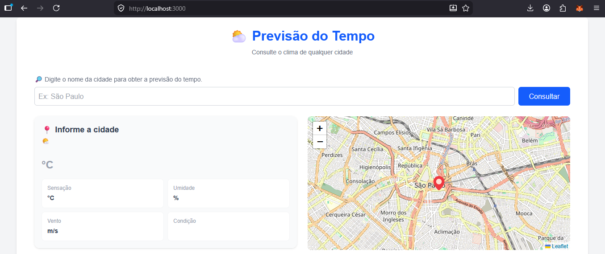
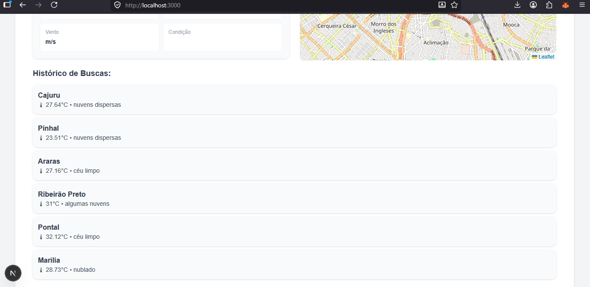

# ⛅ Previsão do Tempo

Aplicação fullstack para consulta de clima em tempo real, com histórico de buscas e visualização em mapa.

## 🚀 Preview




## 🛠️ Tecnologias

### Frontend
- Next.js (React)
- TypeScript
- TailwindCSS
- React Leaflet

### Backend
- FastAPI
- Python

---

## 📦 Instalação

### 1. Clonar os repositórios

## API
```bash
git clone https://github.com/seu-usuario/seu-repo.git
cd seu-repo

## Frontend
```bash
git clone https://github.com/seu-usuario/seu-repo.git
cd seu-repo

## Instalar dependências
## DEPENDENCIAS API
pip install fastapi uvicorn requests
pip install python-dotenv

## DEPENDENCIAS APP
npm install leaflet react-leaflet
npm install react-hot-toast

## Rodando o Projeto
### 1. Backend (FastAPI)

```bash
cd backend
pip install -r requirements.txt
uvicorn main:app --reload
``` 

Disponível em [http://localhost:8000](http://localhost:8000)


### 1. Frontend (Next.js)

```bash
cd frontend
npm install
npm run dev
```

Disponível em [http://localhost:3000](http://localhost:3000)
